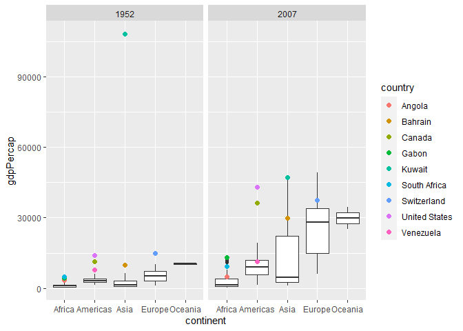

Gapminder
================
Lili Baker
2023-02-16

- <a href="#grading-rubric" id="toc-grading-rubric">Grading Rubric</a>
  - <a href="#individual" id="toc-individual">Individual</a>
  - <a href="#due-date" id="toc-due-date">Due Date</a>
- <a href="#guided-eda" id="toc-guided-eda">Guided EDA</a>
  - <a
    href="#q0-perform-your-first-checks-on-the-dataset-what-variables-are-in-this"
    id="toc-q0-perform-your-first-checks-on-the-dataset-what-variables-are-in-this"><strong>q0</strong>
    Perform your “first checks” on the dataset. What variables are in
    this</a>
  - <a
    href="#q1-determine-the-most-and-least-recent-years-in-the-gapminder-dataset"
    id="toc-q1-determine-the-most-and-least-recent-years-in-the-gapminder-dataset"><strong>q1</strong>
    Determine the most and least recent years in the <code>gapminder</code>
    dataset.</a>
  - <a
    href="#q2-filter-on-years-matching-year_min-and-make-a-plot-of-the-gdp-per-capita-against-continent-choose-an-appropriate-geom_-to-visualize-the-data-what-observations-can-you-make"
    id="toc-q2-filter-on-years-matching-year_min-and-make-a-plot-of-the-gdp-per-capita-against-continent-choose-an-appropriate-geom_-to-visualize-the-data-what-observations-can-you-make"><strong>q2</strong>
    Filter on years matching <code>year_min</code>, and make a plot of the
    GDP per capita against continent. Choose an appropriate
    <code>geom_</code> to visualize the data. What observations can you
    make?</a>
  - <a
    href="#q3-you-should-have-found-at-least-three-outliers-in-q2-but-possibly-many-more-identify-those-outliers-figure-out-which-countries-they-are"
    id="toc-q3-you-should-have-found-at-least-three-outliers-in-q2-but-possibly-many-more-identify-those-outliers-figure-out-which-countries-they-are"><strong>q3</strong>
    You should have found <em>at least</em> three outliers in q2 (but
    possibly many more!). Identify those outliers (figure out which
    countries they are).</a>
  - <a
    href="#q4-create-a-plot-similar-to-yours-from-q2-studying-both-year_min-and-year_max-find-a-way-to-highlight-the-outliers-from-q3-on-your-plot-in-a-way-that-lets-you-identify-which-country-is-which-compare-the-patterns-between-year_min-and-year_max"
    id="toc-q4-create-a-plot-similar-to-yours-from-q2-studying-both-year_min-and-year_max-find-a-way-to-highlight-the-outliers-from-q3-on-your-plot-in-a-way-that-lets-you-identify-which-country-is-which-compare-the-patterns-between-year_min-and-year_max"><strong>q4</strong>
    Create a plot similar to yours from q2 studying both
    <code>year_min</code> and <code>year_max</code>. Find a way to highlight
    the outliers from q3 on your plot <em>in a way that lets you identify
    which country is which</em>. Compare the patterns between
    <code>year_min</code> and <code>year_max</code>.</a>
- <a href="#your-own-eda" id="toc-your-own-eda">Your Own EDA</a>
  - <a
    href="#q5-create-at-least-three-new-figures-below-with-each-figure-try-to-pose-new-questions-about-the-data"
    id="toc-q5-create-at-least-three-new-figures-below-with-each-figure-try-to-pose-new-questions-about-the-data"><strong>q5</strong>
    Create <em>at least</em> three new figures below. With each figure, try
    to pose new questions about the data.</a>

*Purpose*: Learning to do EDA well takes practice! In this challenge
you’ll further practice EDA by first completing a guided exploration,
then by conducting your own investigation. This challenge will also give
you a chance to use the wide variety of visual tools we’ve been
learning.

<!-- include-rubric -->

# Grading Rubric

<!-- -------------------------------------------------- -->

Unlike exercises, **challenges will be graded**. The following rubrics
define how you will be graded, both on an individual and team basis.

## Individual

<!-- ------------------------- -->

| Category    | Needs Improvement                                                                                                | Satisfactory                                                                                                               |
|-------------|------------------------------------------------------------------------------------------------------------------|----------------------------------------------------------------------------------------------------------------------------|
| Effort      | Some task **q**’s left unattempted                                                                               | All task **q**’s attempted                                                                                                 |
| Observed    | Did not document observations, or observations incorrect                                                         | Documented correct observations based on analysis                                                                          |
| Supported   | Some observations not clearly supported by analysis                                                              | All observations clearly supported by analysis (table, graph, etc.)                                                        |
| Assessed    | Observations include claims not supported by the data, or reflect a level of certainty not warranted by the data | Observations are appropriately qualified by the quality & relevance of the data and (in)conclusiveness of the support      |
| Specified   | Uses the phrase “more data are necessary” without clarification                                                  | Any statement that “more data are necessary” specifies which *specific* data are needed to answer what *specific* question |
| Code Styled | Violations of the [style guide](https://style.tidyverse.org/) hinder readability                                 | Code sufficiently close to the [style guide](https://style.tidyverse.org/)                                                 |

## Due Date

<!-- ------------------------- -->

All the deliverables stated in the rubrics above are due **at midnight**
before the day of the class discussion of the challenge. See the
[Syllabus](https://docs.google.com/document/d/1qeP6DUS8Djq_A0HMllMqsSqX3a9dbcx1/edit?usp=sharing&ouid=110386251748498665069&rtpof=true&sd=true)
for more information.

``` r
library(tidyverse)
```

    ## ── Attaching packages ─────────────────────────────────────── tidyverse 1.3.2 ──
    ## ✔ ggplot2 3.4.0      ✔ purrr   1.0.1 
    ## ✔ tibble  3.1.8      ✔ dplyr   1.0.10
    ## ✔ tidyr   1.2.1      ✔ stringr 1.5.0 
    ## ✔ readr   2.1.3      ✔ forcats 0.5.2 
    ## ── Conflicts ────────────────────────────────────────── tidyverse_conflicts() ──
    ## ✖ dplyr::filter() masks stats::filter()
    ## ✖ dplyr::lag()    masks stats::lag()

``` r
library(gapminder)
```

*Background*: [Gapminder](https://www.gapminder.org/about-gapminder/) is
an independent organization that seeks to educate people about the state
of the world. They seek to counteract the worldview constructed by a
hype-driven media cycle, and promote a “fact-based worldview” by
focusing on data. The dataset we’ll study in this challenge is from
Gapminder.

# Guided EDA

<!-- -------------------------------------------------- -->

First, we’ll go through a round of *guided EDA*. Try to pay attention to
the high-level process we’re going through—after this guided round
you’ll be responsible for doing another cycle of EDA on your own!

### **q0** Perform your “first checks” on the dataset. What variables are in this

dataset?

``` r
## TASK: Do your "first checks" here!
glimpse(gapminder)
```

    ## Rows: 1,704
    ## Columns: 6
    ## $ country   <fct> "Afghanistan", "Afghanistan", "Afghanistan", "Afghanistan", …
    ## $ continent <fct> Asia, Asia, Asia, Asia, Asia, Asia, Asia, Asia, Asia, Asia, …
    ## $ year      <int> 1952, 1957, 1962, 1967, 1972, 1977, 1982, 1987, 1992, 1997, …
    ## $ lifeExp   <dbl> 28.801, 30.332, 31.997, 34.020, 36.088, 38.438, 39.854, 40.8…
    ## $ pop       <int> 8425333, 9240934, 10267083, 11537966, 13079460, 14880372, 12…
    ## $ gdpPercap <dbl> 779.4453, 820.8530, 853.1007, 836.1971, 739.9811, 786.1134, …

``` r
?gapminder
```

    ## starting httpd help server ... done

**Observations**:

- Write all variable names here country, continent, year, lifeExp, pop,
  gdpPercap

### **q1** Determine the most and least recent years in the `gapminder` dataset.

*Hint*: Use the `pull()` function to get a vector out of a tibble.
(Rather than the `$` notation of base R.)

``` r
## TASK: Find the largest and smallest values of `year` in `gapminder`
year_max <- gapminder %>% 
  pull(var = year) %>% 
  max()

year_min <- gapminder %>% 
  pull(var = year) %>% 
  min()
```

Use the following test to check your work.

``` r
## NOTE: No need to change this
assertthat::assert_that(year_max %% 7 == 5)
```

    ## [1] TRUE

``` r
assertthat::assert_that(year_max %% 3 == 0)
```

    ## [1] TRUE

``` r
assertthat::assert_that(year_min %% 7 == 6)
```

    ## [1] TRUE

``` r
assertthat::assert_that(year_min %% 3 == 2)
```

    ## [1] TRUE

``` r
if (is_tibble(year_max)) {
  print("year_max is a tibble; try using `pull()` to get a vector")
  assertthat::assert_that(False)
}

print("Nice!")
```

    ## [1] "Nice!"

### **q2** Filter on years matching `year_min`, and make a plot of the GDP per capita against continent. Choose an appropriate `geom_` to visualize the data. What observations can you make?

You may encounter difficulties in visualizing these data; if so document
your challenges and attempt to produce the most informative visual you
can.

``` r
## TASK: Create a visual of gdpPercap vs continent
gapminder %>% 
  filter(year == year_min) %>% 
  ggplot(aes(continent, gdpPercap)) +
    geom_violin(draw_quantiles = c(0.25, 0.5, 0.75))
```

<!-- -->

**Observations**:

- Oceania tends to have the highest gdp per capita as the entirety of
  the boxplot is greater than that of the other continents, excluding
  outliers. Additionally, Europe appears to have the largest
  interquartile range, while Oceania has the smallest.

**Difficulties & Approaches**:

- When trying to visualize the data through a simple boxplot, the visual
  was not very informative as the outlier of Kuwait in Asia resulted in
  the inability to distinguish the boxplots of the continents as the
  majority of the gdp per capita data remained within the range of 0 to
  15000 USD, while the outlier was 108392 USD. This difference in scale
  resulted in the boxplots appearing as a single line, making it
  difficult to analyze the data. To counteract this problem, I decided
  to use a violin plot, which made it easier to see the density of data,
  as well as the quartiles, despite the scaling issue resulting from the
  outlier of Kuwait.

### **q3** You should have found *at least* three outliers in q2 (but possibly many more!). Identify those outliers (figure out which countries they are).

``` r
## TASK: Identify the outliers from q2
outliers <- gapminder %>% 
  filter(
    year == year_min,
    gdpPercap > 12500
  )
outliers
```

    ## # A tibble: 3 × 6
    ##   country       continent  year lifeExp       pop gdpPercap
    ##   <fct>         <fct>     <int>   <dbl>     <int>     <dbl>
    ## 1 Kuwait        Asia       1952    55.6    160000   108382.
    ## 2 Switzerland   Europe     1952    69.6   4815000    14734.
    ## 3 United States Americas   1952    68.4 157553000    13990.

**Observations**:

- Identify the outlier countries from q2
  - Kuwait, Switzerland, United States

*Hint*: For the next task, it’s helpful to know a ggplot trick we’ll
learn in an upcoming exercise: You can use the `data` argument inside
any `geom_*` to modify the data that will be plotted *by that geom
only*. For instance, you can use this trick to filter a set of points to
label:

``` r
## NOTE: No need to edit, use ideas from this in q4 below
gapminder %>%
  filter(year == max(year)) %>%

  ggplot(aes(continent, lifeExp)) +
  geom_boxplot() +
  geom_point(
    data = . %>% filter(country %in% c("United Kingdom", "Japan", "Zambia")),
    mapping = aes(color = country),
    size = 2
  )
```

<!-- -->

### **q4** Create a plot similar to yours from q2 studying both `year_min` and `year_max`. Find a way to highlight the outliers from q3 on your plot *in a way that lets you identify which country is which*. Compare the patterns between `year_min` and `year_max`.

*Hint*: We’ve learned a lot of different ways to show multiple
variables; think about using different aesthetics or facets.

``` r
## TASK: Create a visual of gdpPercap vs continent
gapminder %>% 
  filter(year == year_min | year == year_max) %>% 
  ggplot(aes(continent, gdpPercap)) +
  geom_boxplot() +
  geom_point(
    data = . %>% filter(country %in% c("United States", "Kuwait", "Switzerland")),
    mapping = aes(color = country),
    size = 2
  ) +
    facet_grid(~ year)
```

<!-- -->

**Observations**:

- Both the United States and Switzerland experienced a growth in GDP per
  capita from 1952 to 2007. Conversely, Kuwait experienced a much
  greater decrease in GDP per capita from 1952 to 2007. However, while
  Kuwait may have experienced a large decrease in GDP per capita, it
  still had a higehr GDP per capita than both Switzerland and the United
  States, even after their relatively smaller increases in GDP per
  capita.
- Additionally, both Kuwait and Switzerland changed from being outliers
  to not in 2007, whilst the United States remained an outlier and moved
  farther away from the majority of the data in the Americas.
- Overall, the interquartile range for GDP per capita in each continent
  increased, even if the median tended to stay around the same. That
  being said, the median tended to increase from 1952 to 2007, and the
  relative positions of each continent remained the same, with Oceania
  having the highest GDP per capita, and Africa having the least.

# Your Own EDA

<!-- -------------------------------------------------- -->

Now it’s your turn! We just went through guided EDA considering the GDP
per capita at two time points. You can continue looking at outliers,
consider different years, repeat the exercise with `lifeExp`, consider
the relationship between variables, or something else entirely.

### **q5** Create *at least* three new figures below. With each figure, try to pose new questions about the data.

Question: How did the life expectancy in each continent shift from 1952
to 2007?

``` r
## lifeExp vs continent
gapminder %>% 
  filter(year == year_min | year == year_max) %>% 
  ggplot(aes(continent, lifeExp)) +
  geom_boxplot() +
  geom_point(
    data = . %>% filter(country %in% c("Reunion", "Turkey", "Haiti", "Afghanistan")),
    mapping = aes(color = country),
    size = 2
  ) +
    facet_grid(~ year) +
  labs(title = "Life Expectancy in 1952 and 2007")
```

<!-- -->

- Generally, life expectancy increased from 1952 to 2007 for every
  continent. However, continents that initially had a larger spread of
  life expectancy – such as the Americas and Asia – experienced a
  decrease in the spread of life expectancy, whilst continents that had
  a smaller spread – such as Africa and Oceania – experienced an
  increase in the spread of life expectancy.
- In terms of outliers, Haiti and Afghanistan became outliers in their
  continents by having significantly lower life expectancies in 2007,
  even if their life expectancy had increased from 1952 to 2007. On the
  other hand, Reunion and Turkey started off as outliers in their
  respective continents before lying just on the outer edges of their
  continent extrema in 2007.

Question: Is there an observable relationship between GDP per capita and
life expectancy?

``` r
## gdpPercap vs lifeExp
gapminder %>% 
  filter(year == year_min | year == year_max) %>% 
  ggplot(aes(lifeExp, gdpPercap)) +
  geom_point(aes(color = continent)) +
    facet_grid(~ year) +
  labs(title = "GDP Per Capita vs Life Expectancy")
```

<!-- -->

- Between 1957 and 2007, there was an overall increase in life
  expectancy that was not dependent on the continent nor the GDP per
  capita, as evidenced by the overall shift from around 30-74 as the
  life expectancy range in 1957 to 40-83 in 2007. While in both years
  countries with higher GDP per capita had a higher life expectancy, the
  amount of countries with higher GDPs and higher life expectancies is
  much greater. That being said, this relationship is limited for
  numerous reasons. As seen in 2007, there are several countries with
  higher GDPs that also have relatively low life expectancies between
  50-60 years. Moreover, the range in GDP exhibited in 2007 at the
  higher end of life expectancy (70-80) suggests that other factors are
  involved. Additionally, given the fact that life expectancy is a
  limited variable to consider due to natural constraints, there is not
  a wide enough range to be able to determine if there is in fact a
  relationship as many of the countries have similar life expectancy
  values.

Question: Did the country with the largest population in each continent
change from 1952 to 2007?

``` r
## population outliers in 1952 vs 2007
gapminder %>% 
  filter(year == year_max | year == year_min) %>% 
  ggplot(aes(continent, pop)) +
  geom_boxplot() +
  geom_point(
    data = . %>% filter(country %in% c("China", "United States", "Nigeria", "Germany")),
    mapping = aes(color = country),
    size = 2
  ) +
  facet_grid(~ year) +
  labs(title = "Population Outliers in 1952 and 2007")
```

<!-- -->

- Each of the countries with the largest population in each continent in
  1952 remained the same in 2007. The largest increase in population
  occurred in China, whilst Germany’s population increased the least
  among the population outliers highlighted. It is important to note
  that as Oceania consists of just New Zealand and Australia in this
  dataset, there are not enough data points for outliers.
- Overall, Asia experienced the largest increase in interquartile range,
  as well as the largest growth in the outliers, which were China,
  India, Indonesia, and Pakistan.
