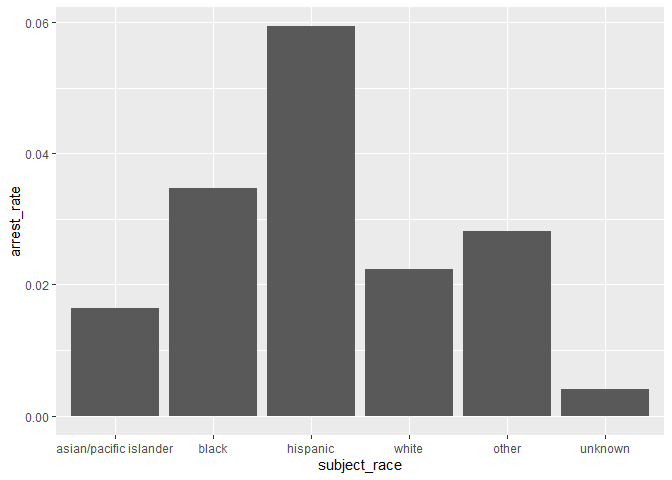
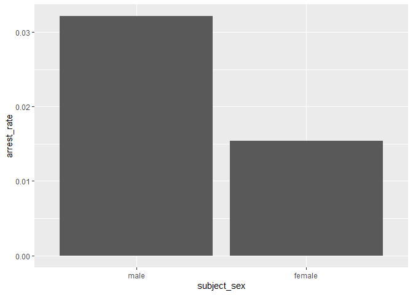
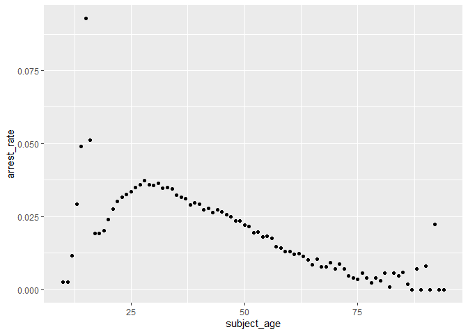

Massachusetts Highway Stops
================
Lili Baker
2023-04-24

- <a href="#grading-rubric" id="toc-grading-rubric">Grading Rubric</a>
  - <a href="#individual" id="toc-individual">Individual</a>
  - <a href="#due-date" id="toc-due-date">Due Date</a>
- <a href="#setup" id="toc-setup">Setup</a>
  - <a
    href="#q1-go-to-the-stanford-open-policing-project-page-and-download-the-massachusetts-state-police-records-in-rds-format-move-the-data-to-your-data-folder-and-match-the-filename-to-load-the-data"
    id="toc-q1-go-to-the-stanford-open-policing-project-page-and-download-the-massachusetts-state-police-records-in-rds-format-move-the-data-to-your-data-folder-and-match-the-filename-to-load-the-data"><strong>q1</strong>
    Go to the Stanford Open Policing Project page and download the
    Massachusetts State Police records in <code>Rds</code> format. Move the
    data to your <code>data</code> folder and match the
    <code>filename</code> to load the data.</a>
- <a href="#eda" id="toc-eda">EDA</a>
  - <a
    href="#q2-do-your-first-checks-on-the-dataset-what-are-the-basic-facts-about-this-dataset"
    id="toc-q2-do-your-first-checks-on-the-dataset-what-are-the-basic-facts-about-this-dataset"><strong>q2</strong>
    Do your “first checks” on the dataset. What are the basic facts about
    this dataset?</a>
  - <a
    href="#q3-check-the-set-of-factor-levels-for-subject_race-and-raw_race-what-do-you-note-about-overlap--difference-between-the-two-sets"
    id="toc-q3-check-the-set-of-factor-levels-for-subject_race-and-raw_race-what-do-you-note-about-overlap--difference-between-the-two-sets"><strong>q3</strong>
    Check the set of factor levels for <code>subject_race</code> and
    <code>raw_Race</code>. What do you note about overlap / difference
    between the two sets?</a>
  - <a
    href="#q4-check-whether-subject_race-and-raw_race-match-for-a-large-fraction-of-cases-which-of-the-two-hypotheses-above-is-most-likely-based-on-your-results"
    id="toc-q4-check-whether-subject_race-and-raw_race-match-for-a-large-fraction-of-cases-which-of-the-two-hypotheses-above-is-most-likely-based-on-your-results"><strong>q4</strong>
    Check whether <code>subject_race</code> and <code>raw_Race</code> match
    for a large fraction of cases. Which of the two hypotheses above is most
    likely, based on your results?</a>
  - <a href="#vis" id="toc-vis">Vis</a>
    - <a
      href="#q5-compare-the-arrest-ratethe-fraction-of-total-cases-in-which-the-subject-was-arrestedacross-different-factors-create-as-many-visuals-or-tables-as-you-need-but-make-sure-to-check-the-trends-across-all-of-the-subject-variables-answer-the-questions-under-observations-below"
      id="toc-q5-compare-the-arrest-ratethe-fraction-of-total-cases-in-which-the-subject-was-arrestedacross-different-factors-create-as-many-visuals-or-tables-as-you-need-but-make-sure-to-check-the-trends-across-all-of-the-subject-variables-answer-the-questions-under-observations-below"><strong>q5</strong>
      Compare the <em>arrest rate</em>—the fraction of total cases in which
      the subject was arrested—across different factors. Create as many
      visuals (or tables) as you need, but make sure to check the trends
      across all of the <code>subject</code> variables. Answer the questions
      under <em>observations</em> below.</a>
- <a href="#modeling" id="toc-modeling">Modeling</a>
  - <a
    href="#q6-run-the-following-code-and-interpret-the-regression-coefficients-answer-the-the-questions-under-observations-below"
    id="toc-q6-run-the-following-code-and-interpret-the-regression-coefficients-answer-the-the-questions-under-observations-below"><strong>q6</strong>
    Run the following code and interpret the regression coefficients. Answer
    the the questions under <em>observations</em> below.</a>
  - <a
    href="#q7-re-fit-the-logistic-regression-from-q6-setting-white-as-the-reference-level-for-subject_race-interpret-the-the-model-terms-and-answer-the-questions-below"
    id="toc-q7-re-fit-the-logistic-regression-from-q6-setting-white-as-the-reference-level-for-subject_race-interpret-the-the-model-terms-and-answer-the-questions-below"><strong>q7</strong>
    Re-fit the logistic regression from q6 setting <code>"white"</code> as
    the reference level for <code>subject_race</code>. Interpret the the
    model terms and answer the questions below.</a>
  - <a
    href="#q8-re-fit-the-model-using-a-factor-indicating-the-presence-of-contraband-in-the-subjects-vehicle-answer-the-questions-under-observations-below"
    id="toc-q8-re-fit-the-model-using-a-factor-indicating-the-presence-of-contraband-in-the-subjects-vehicle-answer-the-questions-under-observations-below"><strong>q8</strong>
    Re-fit the model using a factor indicating the presence of contraband in
    the subject’s vehicle. Answer the questions under <em>observations</em>
    below.</a>
  - <a
    href="#q9-go-deeper-pose-at-least-one-more-question-about-the-data-and-fit-at-least-one-more-model-in-support-of-answering-that-question"
    id="toc-q9-go-deeper-pose-at-least-one-more-question-about-the-data-and-fit-at-least-one-more-model-in-support-of-answering-that-question"><strong>q9</strong>
    Go deeper: Pose at least one more question about the data and fit at
    least one more model in support of answering that question.</a>
  - <a href="#further-reading" id="toc-further-reading">Further Reading</a>

*Purpose*: In this last challenge we’ll focus on using logistic
regression to study a large, complicated dataset. Interpreting the
results of a model can be challenging—both in terms of the statistics
and the real-world reasoning—so we’ll get some practice in this
challenge.

<!-- include-rubric -->

# Grading Rubric

<!-- -------------------------------------------------- -->

Unlike exercises, **challenges will be graded**. The following rubrics
define how you will be graded, both on an individual and team basis.

## Individual

<!-- ------------------------- -->

| Category    | Needs Improvement                                                                                                | Satisfactory                                                                                                               |
|-------------|------------------------------------------------------------------------------------------------------------------|----------------------------------------------------------------------------------------------------------------------------|
| Effort      | Some task **q**’s left unattempted                                                                               | All task **q**’s attempted                                                                                                 |
| Observed    | Did not document observations, or observations incorrect                                                         | Documented correct observations based on analysis                                                                          |
| Supported   | Some observations not clearly supported by analysis                                                              | All observations clearly supported by analysis (table, graph, etc.)                                                        |
| Assessed    | Observations include claims not supported by the data, or reflect a level of certainty not warranted by the data | Observations are appropriately qualified by the quality & relevance of the data and (in)conclusiveness of the support      |
| Specified   | Uses the phrase “more data are necessary” without clarification                                                  | Any statement that “more data are necessary” specifies which *specific* data are needed to answer what *specific* question |
| Code Styled | Violations of the [style guide](https://style.tidyverse.org/) hinder readability                                 | Code sufficiently close to the [style guide](https://style.tidyverse.org/)                                                 |

## Due Date

<!-- ------------------------- -->

All the deliverables stated in the rubrics above are due **at midnight**
before the day of the class discussion of the challenge. See the
[Syllabus](https://docs.google.com/document/d/1qeP6DUS8Djq_A0HMllMqsSqX3a9dbcx1/edit?usp=sharing&ouid=110386251748498665069&rtpof=true&sd=true)
for more information.

*Background*: We’ll study data from the [Stanford Open Policing
Project](https://openpolicing.stanford.edu/data/), specifically their
dataset on Massachusetts State Patrol police stops.

``` r
library(tidyverse)
```

    ## ── Attaching packages ─────────────────────────────────────── tidyverse 1.3.2 ──
    ## ✔ ggplot2 3.4.0      ✔ purrr   1.0.1 
    ## ✔ tibble  3.1.8      ✔ dplyr   1.0.10
    ## ✔ tidyr   1.2.1      ✔ stringr 1.5.0 
    ## ✔ readr   2.1.3      ✔ forcats 0.5.2 
    ## ── Conflicts ────────────────────────────────────────── tidyverse_conflicts() ──
    ## ✖ dplyr::filter() masks stats::filter()
    ## ✖ dplyr::lag()    masks stats::lag()

``` r
library(broom)
```

# Setup

<!-- -------------------------------------------------- -->

### **q1** Go to the [Stanford Open Policing Project](https://openpolicing.stanford.edu/data/) page and download the Massachusetts State Police records in `Rds` format. Move the data to your `data` folder and match the `filename` to load the data.

*Note*: An `Rds` file is an R-specific file format. The function
`readRDS` will read these files.

``` r
## TODO: Download the data, move to your data folder, and load it
filename <- "./data/yg821jf8611_ma_statewide_2020_04_01.rds"
df_data <- readRDS(filename)
```

# EDA

<!-- -------------------------------------------------- -->

### **q2** Do your “first checks” on the dataset. What are the basic facts about this dataset?

``` r
glimpse(df_data)
```

    ## Rows: 3,416,238
    ## Columns: 24
    ## $ raw_row_number             <chr> "1", "2", "3", "4", "5", "6", "7", "8", "9"…
    ## $ date                       <date> 2007-06-06, 2007-06-07, 2007-06-07, 2007-0…
    ## $ location                   <chr> "MIDDLEBOROUGH", "SEEKONK", "MEDFORD", "MED…
    ## $ county_name                <chr> "Plymouth County", "Bristol County", "Middl…
    ## $ subject_age                <int> 33, 36, 56, 37, 22, 34, 54, 31, 21, 56, 56,…
    ## $ subject_race               <fct> white, white, white, white, hispanic, white…
    ## $ subject_sex                <fct> male, male, female, male, female, male, mal…
    ## $ type                       <fct> vehicular, vehicular, vehicular, vehicular,…
    ## $ arrest_made                <lgl> FALSE, FALSE, FALSE, FALSE, FALSE, FALSE, F…
    ## $ citation_issued            <lgl> TRUE, FALSE, FALSE, FALSE, TRUE, TRUE, TRUE…
    ## $ warning_issued             <lgl> FALSE, TRUE, TRUE, TRUE, FALSE, FALSE, FALS…
    ## $ outcome                    <fct> citation, warning, warning, warning, citati…
    ## $ contraband_found           <lgl> NA, FALSE, NA, NA, NA, NA, NA, NA, NA, NA, …
    ## $ contraband_drugs           <lgl> NA, FALSE, NA, NA, NA, NA, NA, NA, NA, NA, …
    ## $ contraband_weapons         <lgl> NA, FALSE, NA, NA, NA, NA, NA, NA, NA, NA, …
    ## $ contraband_alcohol         <lgl> FALSE, FALSE, FALSE, FALSE, FALSE, FALSE, F…
    ## $ contraband_other           <lgl> NA, FALSE, NA, NA, NA, NA, NA, NA, NA, NA, …
    ## $ frisk_performed            <lgl> NA, FALSE, NA, NA, NA, NA, NA, NA, NA, NA, …
    ## $ search_conducted           <lgl> FALSE, TRUE, FALSE, FALSE, FALSE, FALSE, FA…
    ## $ search_basis               <fct> NA, other, NA, NA, NA, NA, NA, NA, NA, NA, …
    ## $ reason_for_stop            <chr> "Speed", NA, NA, NA, NA, "Speed", NA, NA, N…
    ## $ vehicle_type               <chr> "Passenger", "Commercial", "Passenger", "Co…
    ## $ vehicle_registration_state <fct> MA, MA, MA, MA, MA, MA, MA, MA, MA, MA, MA,…
    ## $ raw_Race                   <chr> "White", "White", "White", "White", "Hispan…

- dataset contains data on the subject, the type and outcome of the
  encounter, the contraband found, and the vehicle information

Note that we have both a `subject_race` and `race_Raw` column. There are
a few possibilities as to what `race_Raw` represents:

- `race_Raw` could be the race of the police officer in the stop
- `race_Raw` could be an unprocessed version of `subject_race`

Let’s try to distinguish between these two possibilities.

### **q3** Check the set of factor levels for `subject_race` and `raw_Race`. What do you note about overlap / difference between the two sets?

``` r
## TODO: Determine the factor levels for subject_race and raw_Race
df_data %>% 
  pull(subject_race) %>% 
  levels()
```

    ## [1] "asian/pacific islander" "black"                  "hispanic"              
    ## [4] "white"                  "other"                  "unknown"

``` r
df_data %>% 
  pull(raw_Race) %>% 
  as.factor() %>% 
  levels()
```

    ## [1] "A"                                            
    ## [2] "American Indian or Alaskan Native"            
    ## [3] "Asian or Pacific Islander"                    
    ## [4] "Black"                                        
    ## [5] "Hispanic"                                     
    ## [6] "Middle Eastern or East Indian (South Asian)"  
    ## [7] "None - for no operator present citations only"
    ## [8] "White"

**Observations**:

- What are the unique values for `subject_race`?
  - white, hispanic, black, asian/pacific islander, other, unknown
- What are the unique values for `raw_Race`?
  - White, Hispanic, Black, Asian or Pacific Islander, Middle Eastern or
    East Indian (South Asian), American Indian or Alaskan Native, None -
    for no operator present citations only, A
- What is the overlap between the two sets?
  - White, hispanic, black, asian / pacific islander
- What is the difference between the two sets?
  - other, Middle Eastern or East Indian (South Asian), American Indian
    or Alaskan Native, and unknown / None - for no operator present
    (although these could represent the same things)

### **q4** Check whether `subject_race` and `raw_Race` match for a large fraction of cases. Which of the two hypotheses above is most likely, based on your results?

*Note*: Just to be clear, I’m *not* asking you to do a *statistical*
hypothesis test.

``` r
## TODO: Devise your own way to test the hypothesis posed above.
df_data$raw_Race <- as.factor(df_data$raw_Race)
levels <- c(
  "asian/pacific islander" = "Asian or Pacific Islander",
  "black" = "Black",
  "hispanic" = "Hispanic",
  "white" = "White",
  "other" = "A",
  "other" = "Middle Eastern or East Indian (South Asian)",
  "other" = "American Indian or Alaskan Native",
  "unknown" = "None - for no operator present citations only"
)


df_q4 <- df_data %>%
  mutate(raw_Race = fct_recode(raw_Race,
    !!!levels
  )) %>%
  mutate(
    raw_Race = as.character(raw_Race),
    subject_race = as.character(subject_race),
    same = raw_Race == subject_race
  ) 

df_q4 %>% 
  group_by(same) %>% 
  summarize(
    n = n(),
    pct = n / nrow(df_q4)
  )
```

    ## # A tibble: 3 × 3
    ##   same        n      pct
    ##   <lgl>   <int>    <dbl>
    ## 1 FALSE   64550 0.0189  
    ## 2 TRUE  3350024 0.981   
    ## 3 NA       1664 0.000487

**Observations**

Between the two hypotheses:

- `race_Raw` could be the race of the police officer in the stop
- `race_Raw` could be an unprocessed version of `subject_race`

which is most plausible, based on your results?

- Given that `race_Raw` is equivalent to `subject_race` about 98% of the
  time, `race_Raw` is an unprocessed version of `subject_race`.

## Vis

<!-- ------------------------- -->

### **q5** Compare the *arrest rate*—the fraction of total cases in which the subject was arrested—across different factors. Create as many visuals (or tables) as you need, but make sure to check the trends across all of the `subject` variables. Answer the questions under *observations* below.

(Note: Create as many chunks and visuals as you need)

``` r
df_data %>% 
  drop_na(subject_race) %>% 
  group_by(subject_race) %>%
  summarize(
    num = n(),
    arrest_count = sum(!is.na(arrest_made) & arrest_made == TRUE),
    arrest_rate = arrest_count / num
  ) %>% 
  ggplot() +
  geom_bar(aes(x = subject_race, y = arrest_rate), stat = "identity")
```

<!-- -->

``` r
df_data %>% 
  drop_na(subject_sex) %>% 
  group_by(subject_sex) %>%
  summarize(
    num = n(),
    arrest_count = sum(!is.na(arrest_made) & arrest_made == TRUE),
    arrest_rate = arrest_count / num
  ) %>% 
  ggplot() +
  geom_bar(aes(x = subject_sex, y = arrest_rate), stat = "identity")
```

<!-- -->

``` r
df_data %>% 
  group_by(subject_age) %>%
  summarize(
    num = n(),
    arrest_count = sum(!is.na(arrest_made) & arrest_made == TRUE),
    arrest_rate = arrest_count / num
  ) %>% 
  ggplot(aes(subject_age, arrest_rate)) +
  geom_point()
```

    ## Warning: Removed 1 rows containing missing values (`geom_point()`).

<!-- -->
**Observations**:

- How does `arrest_rate` tend to vary with `subject_age`?
  - Until the age of around 27, arrest rate increases as age increases.
    Afterwards, as age increases, the arrest rate decreases.
- How does `arrest_rate` tend to vary with `subject_sex`?
  - The arrest rate for males is much larger than that of females.
- How does `arrest_rate` tend to vary with `subject_race`?
  - Hispanic and black have the highest arrest_rate, followed by other,
    white, asian/pacific islander, and unknown.

# Modeling

<!-- -------------------------------------------------- -->

We’re going to use a model to study the relationship between `subject`
factors and arrest rate, but first we need to understand a bit more
about *dummy variables*

### **q6** Run the following code and interpret the regression coefficients. Answer the the questions under *observations* below.

``` r
## NOTE: No need to edit; inspect the estimated model terms.
fit_q6 <-
  glm(
    formula = arrest_made ~ subject_age + subject_race + subject_sex,
    data = df_data %>%
      filter(
        !is.na(arrest_made),
        subject_race %in% c("white", "black", "hispanic")
      ),
    family = "binomial"
  )

fit_q6 %>% tidy()
```

    ## # A tibble: 5 × 5
    ##   term                 estimate std.error statistic   p.value
    ##   <chr>                   <dbl>     <dbl>     <dbl>     <dbl>
    ## 1 (Intercept)           -2.67    0.0132      -202.  0        
    ## 2 subject_age           -0.0142  0.000280     -50.5 0        
    ## 3 subject_racehispanic   0.513   0.0119        43.3 0        
    ## 4 subject_racewhite     -0.380   0.0103       -37.0 3.12e-299
    ## 5 subject_sexfemale     -0.755   0.00910      -83.0 0

**Observations**:

- Which `subject_race` levels are included in fitting the model?
  - white, black, and hispanic
- Which `subject_race` levels have terms in the model?
  - white and hispanic

You should find that each factor in the model has a level *missing* in
its set of terms. This is because R represents factors against a
*reference level*: The model treats one factor level as “default”, and
each factor model term represents a change from that “default” behavior.
For instance, the model above treats `subject_sex==male` as the
reference level, so the `subject_sexfemale` term represents the *change
in probability* of arrest due to a person being female (rather than
male).

The this reference level approach to coding factors is necessary for
[technical
reasons](https://www.andrew.cmu.edu/user/achoulde/94842/lectures/lecture10/lecture10-94842.html#why-is-one-of-the-levels-missing-in-the-regression),
but it complicates interpreting the model results. For instance; if we
want to compare two levels, neither of which are the reference level, we
have to consider the difference in their model coefficients. But if we
want to compare all levels against one “baseline” level, then we can
relevel the data to facilitate this comparison.

By default `glm` uses the first factor level present as the reference
level. Therefore we can use
`mutate(factor = fct_relevel(factor, "desired_level"))` to set our
`"desired_level"` as the reference factor.

### **q7** Re-fit the logistic regression from q6 setting `"white"` as the reference level for `subject_race`. Interpret the the model terms and answer the questions below.

``` r
## TODO: Re-fit the logistic regression, but set "white" as the reference
## level for subject_race
fit_q7 <-
  glm(
    formula = arrest_made ~ subject_age + subject_race + subject_sex,
    data = df_data %>%
      filter(
        !is.na(arrest_made),
        subject_race %in% c("white", "black", "hispanic")
      ) %>% 
    mutate(
      subject_race = fct_relevel(subject_race, "white")
    ),
    family = "binomial"
  )

fit_q7 %>% tidy()
```

    ## # A tibble: 5 × 5
    ##   term                 estimate std.error statistic   p.value
    ##   <chr>                   <dbl>     <dbl>     <dbl>     <dbl>
    ## 1 (Intercept)           -3.05    0.0109      -279.  0        
    ## 2 subject_age           -0.0142  0.000280     -50.5 0        
    ## 3 subject_raceblack      0.380   0.0103        37.0 3.12e-299
    ## 4 subject_racehispanic   0.893   0.00859      104.  0        
    ## 5 subject_sexfemale     -0.755   0.00910      -83.0 0

**Observations**:

- Which `subject_race` level has the highest probability of being
  arrested, according to this model? Which has the lowest probability?
  - Hispanic has the highest probability, while white has the lowest
    probability.
- What could explain this difference in probabilities of arrest across
  race? List **multiple** possibilities.
  - Racial profiling of the drivers by the police officers in general;
    increased likelihood of arrests in majority-minority communities;
    and increased likelihood of searches based on race.
- Look at the sent of variables in the dataset; do any of the columns
  relate to a potential explanation you listed?
  - contraband_found relates to the increased likelihood of searches as
    if police officers are more likely to search the vehicles of
    minority drivers, then that increase in the number of searches makes
    it more likely to find contraband than it does for white drivers who
    may not have their vehicles searched.

One way we can explain differential arrest rates is to include some
measure indicating the presence of an arrestable offense. We’ll do this
in a particular way in the next task.

### **q8** Re-fit the model using a factor indicating the presence of contraband in the subject’s vehicle. Answer the questions under *observations* below.

``` r
## TODO: Repeat the modeling above, but control for whether contraband was found
## during the police stop
fit_q8 <-
  glm(
    formula = arrest_made ~ subject_age + subject_race + subject_sex + contraband_found,
    data = df_data %>%
      filter(
        !is.na(arrest_made),
        subject_race %in% c("white", "black", "hispanic")
      ) %>% 
    mutate(
      subject_race = fct_relevel(subject_race, "white")
    ),
    family = "binomial"
  )

fit_q8 %>% tidy()
```

    ## # A tibble: 6 × 5
    ##   term                 estimate std.error statistic   p.value
    ##   <chr>                   <dbl>     <dbl>     <dbl>     <dbl>
    ## 1 (Intercept)           -1.72    0.0339      -50.8  0        
    ## 2 subject_age            0.0225  0.000866     26.0  2.19e-149
    ## 3 subject_raceblack     -0.0511  0.0270       -1.90 5.80e-  2
    ## 4 subject_racehispanic   0.221   0.0237        9.31 1.32e- 20
    ## 5 subject_sexfemale     -0.306   0.0257      -11.9  1.06e- 32
    ## 6 contraband_foundTRUE   0.609   0.0192       31.7  4.29e-221

**Observations**:

- How does controlling for found contraband affect the `subject_race`
  terms in the model?
  - Black drivers are less likely to be arrested compared to white
    drivers when contraband is present. Additionally, while hispanic
    drivers are still the most likely to be arrested, the likelihood has
    significantly decreased.
- What does the *finding of contraband* tell us about the stop? What
  does it *not* tell us about the stop?
  - When contraband is found, that means that a search was performed and
    the officer found contraband in the vehicle. However, it does not
    account for disparities in the rate of searches nor the
    thouroughness of searches across races.

### **q9** Go deeper: Pose at least one more question about the data and fit at least one more model in support of answering that question.

``` r
fit_q9 <-
  glm(
    formula = search_conducted ~ subject_age + subject_race + subject_sex,
    data = df_data %>%
      filter(
        !is.na(arrest_made),
        subject_race %in% c("white", "black", "hispanic")
      ) %>% 
    mutate(
      subject_race = fct_relevel(subject_race, "white")
    ),
    family = "binomial"
  )

fit_q9 %>% tidy()
```

    ## # A tibble: 5 × 5
    ##   term                 estimate std.error statistic   p.value
    ##   <chr>                   <dbl>     <dbl>     <dbl>     <dbl>
    ## 1 (Intercept)           -2.76    0.0141      -195.  0        
    ## 2 subject_age           -0.0379  0.000406     -93.2 0        
    ## 3 subject_raceblack      0.461   0.0124        37.1 1.84e-301
    ## 4 subject_racehispanic   0.685   0.0113        60.8 0        
    ## 5 subject_sexfemale     -0.728   0.0114       -63.8 0

**Observations**:

- How does the probability of a search being conducted differ across
  races?
  - When looking at the likelihood of contraband being found, it is
    beneficial to contextualize these probabilities with the likelihood
    of searches being performed to begin with. It is evident that black
    and hispanic drivers are much more likely to have their vehicles
    searched, and male drivers are significantly more likely to have
    their vehicles searched. From this data, it is clear that the
    probabilities observed in the previous question regarding the
    likelihood of arrest based on contraband being found is affected by
    the fact that black and hispanic drivers are much more likely to
    have their vehicles searched to begin with.

## Further Reading

<!-- -------------------------------------------------- -->

- Stanford Open Policing Project
  [findings](https://openpolicing.stanford.edu/findings/).
